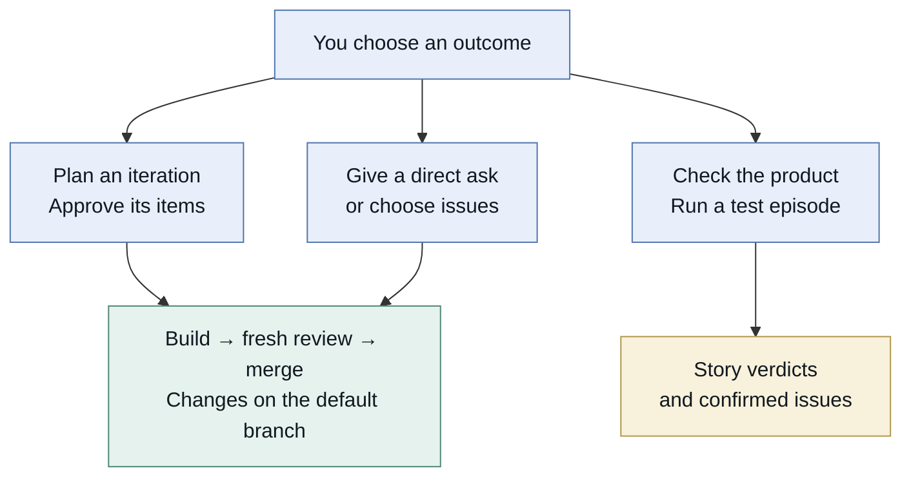
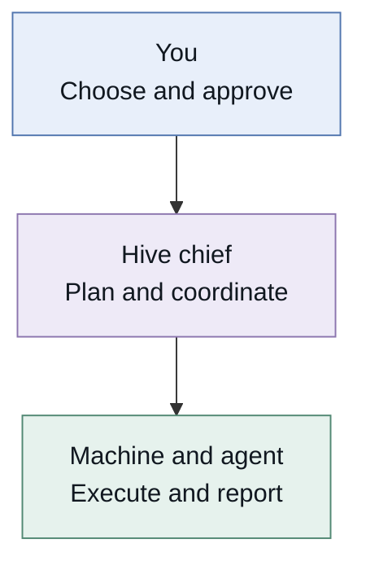
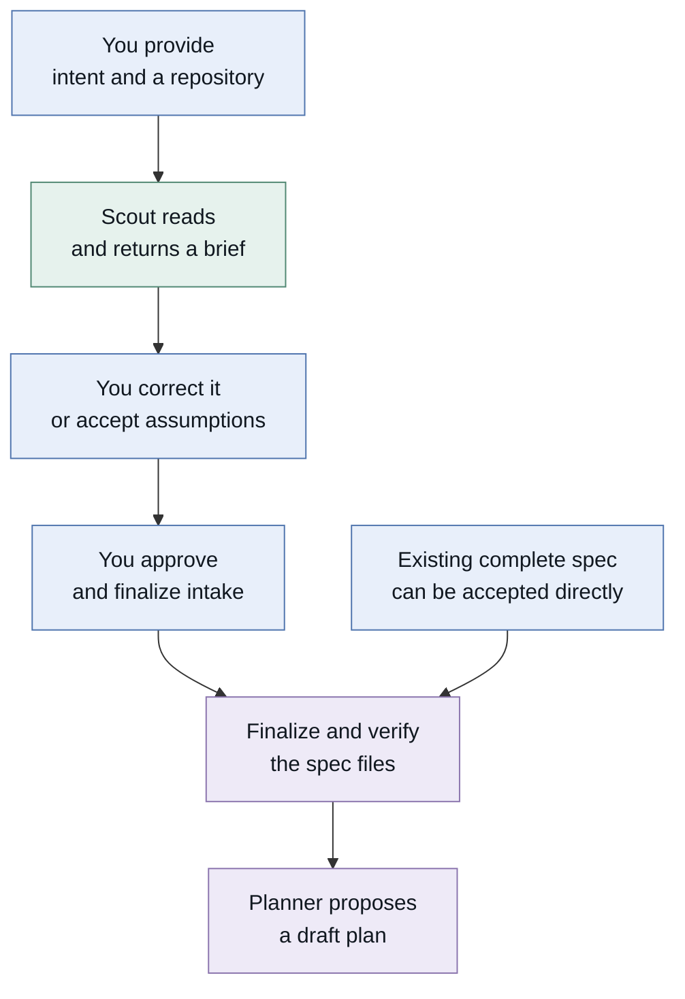
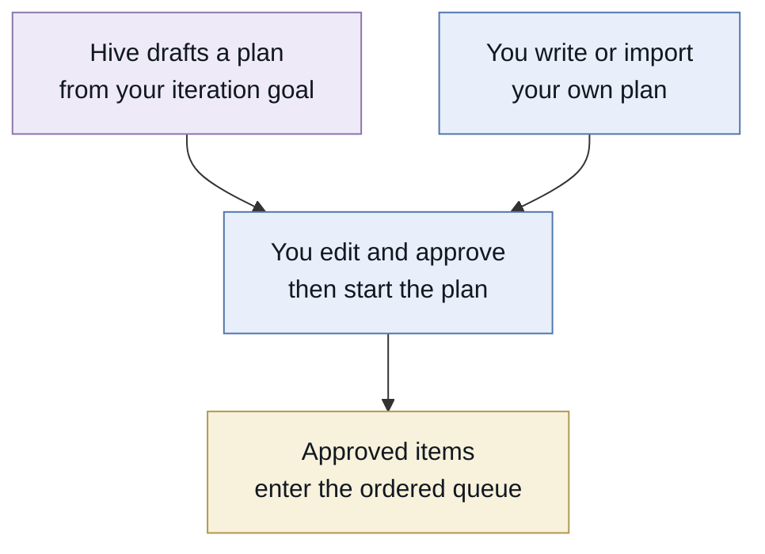
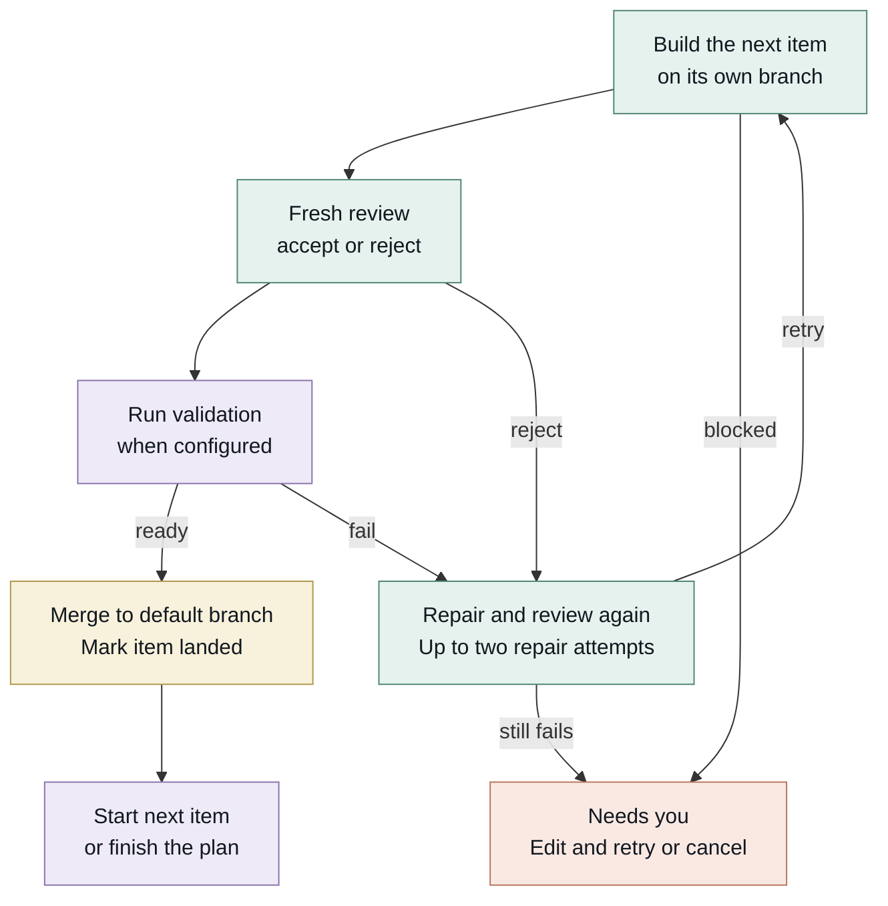
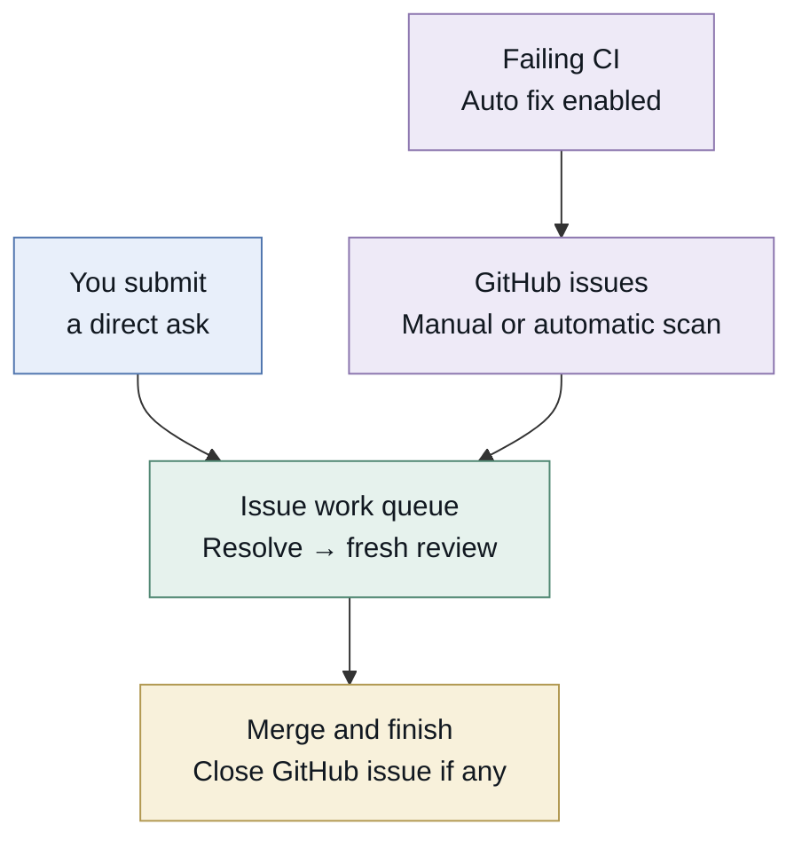
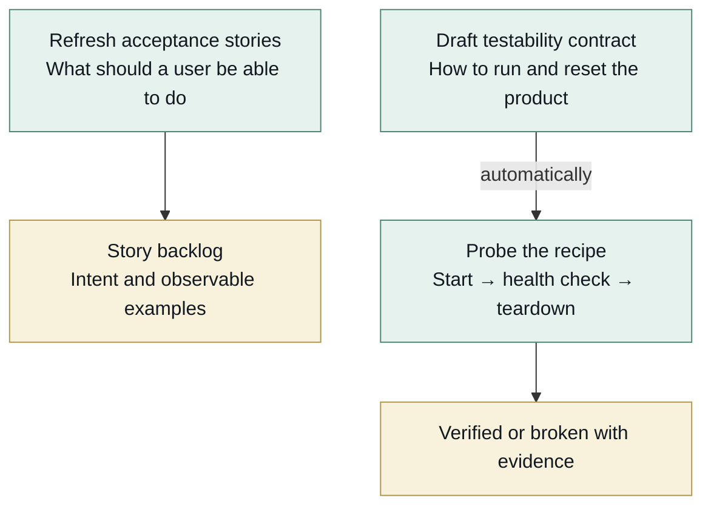
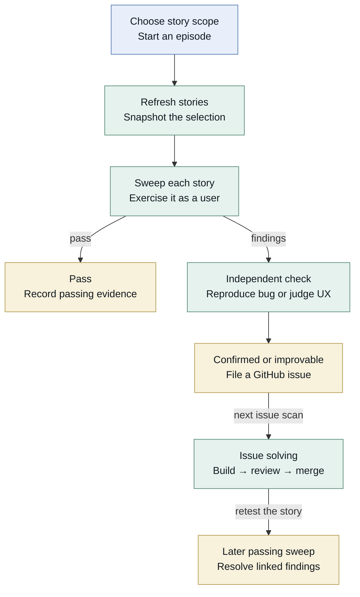
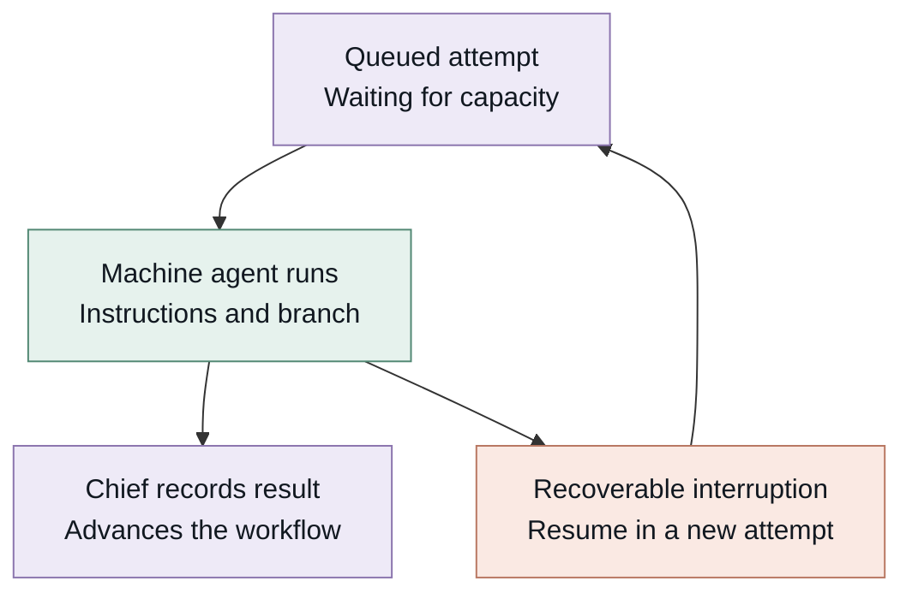
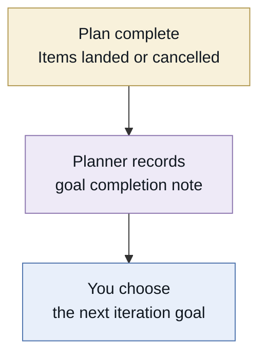

# Hive workflow guide

A user guide to starting work and understanding results

**Code snapshot 6 September 2026 · revision 13bd067**

Hive coordinates coding agents around outcomes you choose. For an iteration, you approve a plan and Hive builds, reviews and lands its items in order. Direct asks and GitHub issues use a separate work queue. Testing checks the product and turns confirmed problems into issues that can be fixed.



You choose an iteration, a direct ask or issues, or a test episode. Iterations and asks lead to reviewed merged changes. Testing produces story verdicts and confirmed issues that can enter issue solving.

**Read the graph:** blue is your action; purple is Hive coordination; green is agent work; gold is a durable result; orange is a wait that needs attention. Arrows show normal progression, not guaranteed success.

### Choose the scenario that matches your intent

| I want to | Go to |
| --- | --- |
| Explain a project before work begins | Scenario 1 · page 3 |
| Approve a proposed plan or bring my own | Scenario 2 · page 4 |
| Understand how approved work gets built | Scenario 3 · page 5 |
| Give one request or fix GitHub issues | Scenario 4 · page 6 |
| Prepare the product for testing | Scenario 5 · page 7 |
| Run tests and follow findings through repair | Scenario 6 · page 8 |
| Understand waits outputs and completion | Pages 9 to 11 |


## The terms you will see

A project holds the long-lived context. A work item represents something you want achieved. A task is one attempt to achieve or check it. Several task attempts can belong to the same work item.

| Term | Meaning in Hive |
| --- | --- |
| Project | A mission, current iteration goal, spec home, code repositories and execution policies. |
| Spec home | The repository holding mission.md, iteration.md, wiki notes and raw input-log material. It may also hold the product code. |
| Workstream | An ongoing channel of project work: iteration work, GitHub issues for a repo, or testing for a repo. |
| Job | Something you launch from the project page. It may become a plan, directive, issue run or test episode. |
| Iteration goal | The outcome you choose for the current round of work. You choose the next one too. |
| Plan and plan item | An ordered set of outcomes you approve. Each item keeps its identity from proposed through landed or cancelled. |
| Directive | A direct ask from you. Hive sends it straight into its issue-solving pipeline without a new GitHub issue. |
| Issue run | A bounded batch of selected GitHub issue numbers or all issues open at the time you start it. |
| Task | One agent execution attempt with instructions, a branch, an outcome and a trace. Task done does not mean the requested feature is landed. |
| Question and human todo | A question needs an answer or decision. A human todo needs an action such as logging in or repairing access. |

### Who does the work



The user chooses and approves outcomes. The chief coordinates work. An agent on a machine executes each assigned attempt and reports to the chief.

The **chief** is the coordinating Hive instance. Its **supervisor** schedules from stored facts; its **planner** uses an LLM to propose plans and assess completion. A **runner** is the connection to a machine. An **agent** is a coding tool usable there; a **scout** is an agent serving the intake role. A **checkout** is one repository working copy on one machine.


## Scenario 1 Align Hive with a project

**Use this when** you have a project or specification and want Hive to understand the intended outcome before proposing implementation work.



Intent and repository go to a scout, who produces a brief. You correct it and explicitly approve intake. Hive writes and verifies the spec, then the planner proposes a draft. Existing complete spec files can be accepted without another writing turn.

### What happens at each step

**1  Provide the starting material.** Create a project, hand over your spec text, and choose an existing repository or create one. With the CLI, hive new without --repo creates a private GitHub repository.

**2  Review the scout brief.** The scout reads the repository and reports the mission, next iteration, likely steps, assumptions, questions and evidence. This reading turn does not change product code or push changes.

**3  Resolve the meaning.** Send answers or corrections. “Proceed with assumptions” asks the scout to continue on that basis; it is not the approval that starts execution.

**4  Approve and finalize intake.** The scout writes and pushes the durable spec where needed. Hive independently checks the required files. A failed push or missing files reopens intake and creates a repair todo.

**5  Receive a proposed plan.** Accepted intake wakes the planner when planning capacity is configured. The plan still needs your approval before its work can execute.

### Inputs and outputs

**Input:** your intent, source material and repository. **Output:** accepted mission.md and iteration.md, then a draft plan. Scouted intake also saves a conversation and brief; finalization is asked to write decisions and preserve supplied raw input. The hard acceptance check is that the two required spec files are nonempty.

**Existing spec shortcut:** when mission.md and iteration.md already contain the accepted intent, Hive can accept those files directly without another scout writing turn. Importing a ready work plan is a different shortcut on the next page.

**Commands:** `hive new NAME --spec FILE --repo URL` · `hive intake PROJECT` · `hive intake PROJECT --approve`


## Scenario 2 Choose and approve a plan

**Use this when** you want a defined set of changes built toward one iteration goal. Hive can draft the plan, or you can supply it directly.



A plan drafted by Hive or imported by you meets the same approval gate. You edit and approve the items, then start the ordered queue. Import with --start performs that approval and start explicitly.

### What you are approving

| Item field | Purpose |
| --- | --- |
| Title | The outcome in a short phrase. |
| Story | Who can do what when the item lands. |
| Constraints | Technical or product boundaries the implementation must respect. |
| Notes | Context, examples and detailed instructions supplied to the builder. |
| Repository | The code repository this item changes, when different from the default. |

**Review and start.** Edit, reorder, add or remove items. Approving an individual item in a draft records your review progress. Start the plan after approval, or use “Approve all & start” in one action. On activation, the approved items enter the queue and Hive attempts to save iteration-plan.md in the spec home. The stored plan remains authoritative if that Git write fails.

### Bring your own Markdown plan

Use a `# Goal` followed by ordered `## Task title` headings. Each task body is preserved as notes. Import bypasses intake and AI planning; without --start it produces a reviewable draft.

```text
hive plan-import PROJECT plan.md --repo URL \
  --validate 'YOUR CHECK COMMAND'
```

Add **--start** to explicitly approve and execute the imported work. A newly created import project defaults to OpenCode builds, Codex reviews with five sessions per day, included capacity, no paid budget and automatic testing off. Existing projects keep their policies unless you override them.

**Changes to a live plan:** new items are proposed amendments and need approval before they execute. Use a new human-selected goal for a new iteration.

**Output:** an approved ordered plan, item documents and a queue ready for available machines. `hive plan PROJECT --watch` shows progress; `hive plan-approve PROJECT` approves and starts.


## Scenario 3 Build review and land an item

**Start:** an approved plan has a queued item. **Finish:** its change is merged into the remote default branch. One plan item progresses at a time, in the order you approved.



Build goes to a fresh review, then optional executable validation, then merge. Rejected review or failed validation receives at most two repair attempts. A blocked build or persistent failure parks the item and stalls the remaining plan. Successful landing starts the next item.

**Build and review.** The builder receives the item document and works on its branch. A successful build hands off to a fresh reviewer session. The reviewer checks behavior and tests, independently probes a relevant boundary through a public interface, and may fix small problems. It records expected versus observed behavior. A fresh session can use the builder’s backend.

**Executable validation when configured.** After review, the runner executes your validation command separately. It must pass on a clean, unchanged, committed and pushed checkout. Hive records the command, output, exit code and tested commit, then merges that exact commit. Without a configured command, landing relies on the reviewer’s acceptance.

**Repair loop.** A rejected review or failed validation sends findings back for up to two automatic repair attempts, each followed by fresh review. A blocked build, review execution error or persistent failure parks the item with a reason. Recoverable interruptions and unfinished reports have separate continuation handling.

**When it needs you.** A parked item stalls the rest of the plan. Inspect the report, edit the item or fix the prerequisite, then Retry. Cancel the item to remove that requirement and let later work proceed. Cancelling its current task first parks the item; it does not remove the item from the plan.

**Landing failure:** Hive keeps the branch and raises a repair todo. Plan landing does not have the issue pipeline’s automatic conflict-integration step.

**Output:** merged code, builder and reviewer reports, attempt history, trace and configured validation evidence. PR creation, deployment and green default-branch CI are separate from this completion condition.


## Scenario 4 Give an ask or fix issues

**Use this when** the work is a direct request or an existing GitHub issue rather than an iteration plan. These inputs converge on the same resolve, review and merge pipeline.



Direct asks seed internal priority work. GitHub issues enter through scanning. Enabled CI auto fix files a diagnostic GitHub issue. All use the issue queue, resolve, fresh review, merge and, if a GitHub issue exists, closure.

| Entry point | What enters the queue |
| --- | --- |
| Give Hive a task | Your text becomes an internal priority item. No plan-approval step and no GitHub issue is created. It does not interrupt running work or a selected issue batch. |
| Fix issues | Issue body, comments and attachments are mirrored from GitHub. Select a bounded batch or run all issues open now. |
| CI auto fix | When enabled, failing default-branch checks produce a diagnostic GitHub issue that enters the same resolver pipeline. |

**Normal path.** Resolve the request or reproduce the bug, implement and push the branch, then review in a fresh session. Acceptance leads to a default-branch merge and, for a GitHub issue, closure. A directive instead receives a final report and a done status.

**Blocked work.** A resolve can request clarification; a reviewer can reject. Ordinary blocked or rejected issues can be left while another queued issue runs. This differs from a plan, where a parked item stops the ordered queue. Read the directive’s routing note even when its badge still says working.

**Retries and conflicts.** Deliberate rescanning can update comments and retry stalled GitHub issues. Automatic scans leave blocked and rejected work parked. An issue merge conflict can trigger an integration review to resolve mechanical conflicts and retest; decisions or other landing failures create a human todo.

**Background behavior.** In the standard chief, enabled issue workstreams scan for new issues about every 10 minutes. CI auto fix is opt-in and polls about every 5 minutes; it also has manual and webhook triggers. A completed CI repair still needs a later CI result to prove the branch is green.

**Commands:** `hive ask PROJECT "request"` · `hive issue-sync PROJECT` refreshes the mirror without queuing fixes in that call · `hive issue-run PROJECT --issue 12 --issue 13` starts a selected batch.


## Scenario 5 Make the product testable

**Use this when** you need both a clear statement of expected behavior and a working recipe for exercising the product. These are separate preparation outputs.



Testing has two preparation tracks: refresh stories into an acceptance backlog; draft a testability recipe and automatically probe it by starting, health checking and tearing down the product.

### Define what should work

**Acceptance stories** describe a user capability with observable rules and examples. “Refresh stories” asks an agent to align acceptance/*.md with the mission, iteration, wiki and raw input. Hive mirrors the files into its story backlog, updates changed stories, archives removed ones and asks questions where intent is unclear. Refreshing alone does not run a test sweep.

### Prove how to run it

The **testability contract** is testability.md in the spec home: how to run, health-check, reset and tear down the product, plus credentials and constraints. The drafting agent explores the actual code. Hive records setup decisions as questions and automatically queues a probe of the recipe.

The probe starts the product, checks health and tears it down. Its output is verified or broken, with evidence and problems. **Fidelity** records the environment actually exercised, such as local execution or Docker; it tells you what the evidence covers.

Answering a setup decision leads to a revised draft and another probe. If a contract task is already running, the answer is saved for the next draft. Changing the contract invalidates its previous proof until another probe succeeds. Drafting and probing can proceed while decision questions are still open.

### Automatic preparation

When automatic testing is enabled and the project is eligible, Hive checks for weak or missing stories, then missing or broken contracts, then unproven contracts. It can refresh, draft or probe before attempting an episode. The next page explains the automatic episode gate.

**Commands:** `hive test-refresh PROJECT` · `hive testability-draft PROJECT` · `hive testability-probe PROJECT` · `hive testability PROJECT`

**Outputs:** acceptance documents and a story backlog; a testability recipe; setup questions, probe evidence and recorded environment fidelity.


## Scenario 6 Test and follow the findings

**Use this when** you want evidence about real user behavior. A test episode is one bounded campaign over a snapshot of stories: priority, selected stories or the full backlog.



Each episode refreshes stories and snapshots a scope, then sweeps each story. Passing stores evidence. Findings receive independent reproduction or UX judgment before an issue is filed. Issue solving lands the fix. A later passing sweep resolves linked confirmed findings.

**Start and select.** Every current episode begins with a story refresh. Hive checks the resulting backlog and snapshots the selected story keys; priority defaults to up to five. An empty or invalid backlog fails the episode with a repair todo.

**Sweep and confirm.** One sweep agent exercises each story as a user. A passing sweep records evidence. Suspected bugs receive independent reproduction; UX concerns receive independent judgment. Confirmed bugs and improvable UX findings become GitHub issues. Non-reproduced or disagreed findings are rejected; constrained UX findings become known limitations.

**Fix and retest.** Filing a finding does not itself start a fix task. The issue scan connects it to issue solving. After repair, a later passing sweep resolves the story’s linked confirmed findings and closes any still-open corresponding testing issues. Rejected or constrained findings do not themselves make the story pass.

**Read the result carefully.** Episode done means the campaign’s tasks settled. The episode can still contain failing or blocked stories. Inspect story verdicts, finding decisions, recorded fidelity and the attached evidence.

**Automatic episodes.** Hive checks untested, stale or failing stories about every 15 minutes, with a 24-hour cooldown for the same action. It needs automatic testing enabled, completed intake, an enabled testing stream, an included-only policy or positive budget, no current episode and a verified contract. Manual episodes do not require that verified-contract gate. Healthy stories do not trigger another episode solely because time has passed.

**Commands:** `hive test-run PROJECT --scope priority` · `hive stories PROJECT` · `hive test-cancel EPISODE_ID`


## Understand progress and waits

The chief matches each queued attempt to a permitted agent, an online machine, the required capabilities and available allowance. One task uses a runner at a time. Mutating work is serialized per repository across the workspace; some testing tasks can run on several machines.



The chief assigns a queued attempt to an eligible machine and agent, records its result and advances the owning workflow. Recoverable interruptions create a new attempt preserving the prior checkout and session.

| What you see | What it means and what to do |
| --- | --- |
| Intake | The project is being aligned. Read the scout brief or the setup/capacity reason. |
| Working | An attempt is running or ready for dispatch. Inspect the plan or activity to see the specific stage. |
| Needs attention | A plan needs approval, a question needs an answer, or an item is parked. Use that item’s concrete action. |
| Blocked resources | The required backend, model, machine, capability or provider quota is unavailable. Read the reason and check Agents or Machines. |
| Blocked budget | The daily spend cap or agent session allowance is exhausted. Wait for the UTC day reset or change the policy. Provider quota follows its own reset. |
| Idle goal complete | Hive recorded completion of the current iteration. Read the note and choose the next goal. |
| Idle | Nothing is queued or running. Inspect whether a draft, goal or completion decision is still needed. |

**Use the reason, not just the badge.** Pending work can also wait for a busy repo or runner. Recovery may need the original machine because unfinished work and its session are there. A recoverable interruption creates a new attempt preserving that work; the failed attempt remains in history.

**Answer or act.** Answering a question saves your answer, logs it in the spec where possible and wakes the planner to update context. Operational todos often close automatically when Hive observes recovery, such as a usable login. A parked plan item still needs its explicit Retry or Cancel action.

**Pause Hive** stops new assignments, planning and scans across the fleet; running tasks finish and report. **Pause project** pauses that project’s scheduled progress. **Pause runner** drains its current task and keeps that machine’s runner stopped. Resume the corresponding scope to continue. Pausing does not cancel the remaining plan.

**Inspect:** `hive project PROJECT` · `hive show agents` · `hive show machines` · `hive show limits` · `hive show autonomy`


## Know what finished and where to look

Hive records several layers of completion. Read the object that corresponds to your intended outcome, then inspect its evidence.

| Result | Meaning and durable output | Where to inspect |
| --- | --- | --- |
| Intake accepted | The required spec files exist and intake is accepted. This does not approve a work plan. | Intake brief and spec home |
| Task done | One attempt returned and was recorded. Its report can still reject or block the parent work item. | Activity; hive task ID; hive trace ID |
| Plan item landed | Its reviewed change merged into the remote default branch. Configured validation evidence is on the review attempt. | Plan rail, review report, repository |
| Directive or issue done | The change landed. A GitHub-backed issue was also closed; a direct ask has a report instead. | Directive card or issue run; repository |
| Test episode done | The campaign settled. Story and finding verdicts determine whether the tested behavior passed. | Testing panel; hive stories PROJECT |
| Plan complete | All items are landed or cancelled, with at least one landed item. If all are cancelled, the plan is abandoned. | Plan rail and item history |
| Iteration goal complete | The planner recorded a goal verdict after the plan completed and project tasks and questions cleared. | Project completion note |

### The end of one iteration



Once all items are terminal and at least one landed, the plan is complete. When no tasks or questions remain, the planner may record goal completion. The user then chooses the next iteration goal.

The planner is instructed to record an outcome note with **Try it:** commands and verification evidence. Completion is structurally gated by a completed plan, no pending or running project tasks and no open questions. The exact wording of the note is not enforced by code.

You set the next goal through Hive or `hive iterate PROJECT "next outcome"`. Hive stores it as pending and asks for a new draft plan. The planner is prevented from inventing the next iteration goal after the previous plan completes.

**Separate evidence:** a merge does not establish deployment or green CI. A successful test probe proves the run recipe, not every user story. A passing story is evidence for that story and recorded environment, not a whole-product guarantee.


## Current boundaries and source map

### Behavior to keep in mind

**Machine Sync is a preview.** Hive reports checkout branch, ahead/behind and uncommitted-work facts. Drift means unpushed commits or a dirty tree. The visible Sync action does not yet launch an agent that consolidates that work; environment readiness is also a reserved field.

**The current landing paths merge branches directly.** Iteration items, directives and GitHub issues use resolve and fresh review. Older descriptions of a separate work/verify pipeline, unchecked direct landing followed by verification, or a universal human PR merge gate do not describe these paths.

**Spec critique is a separate tool today.** The critique library and local script can produce a report. Automatic critique during intake, automatic posting of its questions and the full proposed decision-ledger loop are not wired into the current chief workflow.

**Background work depends on configuration.** The standard chief wires issue scanning, optional CI auto fix and eligible automatic testing. Pauses, budgets, capabilities, credentials and enabled workstreams govern whether they can act. Imported-plan projects start with different defaults from ordinary new projects.

### Implementation references

This guide describes repository behavior at revision **13bd067** on **6 September 2026**. It is a code snapshot, not a live status report of the deployed chief. The code and tests below are the reference points for the scenarios.

| Area | Primary source and verification |
| --- | --- |
| Definitions and state | hive/models.py; hive/_control/supervisor.py; CONTEXT.md |
| Intake and acceptance | hive/_control/intake.py; hive/runner/_task_results.py; tests/test_api_e2e.py |
| Import and approval | hive/cli.py; hive/_workstreams/plan_document.py; hive/_workstreams/plans.py; tests/test_plans.py |
| Review and landing | hive/runner/_task_results.py; hive/runner/_validation.py; tests/test_plan_validation.py |
| Goal completion | hive/_control/orchestrator.py; tests/test_orchestrator_completion.py |
| Directives issues and CI | hive/_workstreams/issues.py; hive/_workstreams/ci.py; hive/api.py; tests/test_issues.py; tests/test_ci.py |
| Testing and setup | hive/_workstreams/testing.py; hive/_workstreams/testability.py; hive/_control/clarifications.py; tests/test_testability.py |
| Capacity and recovery | hive/_control/supervisor.py; hive/_control/retries.py; hive/_control/pause.py; hive/runner/control.py |
| Visible actions and limits | web/src/features/project/; hive/_workstreams/critique.py; scripts/spec_critique.py |

