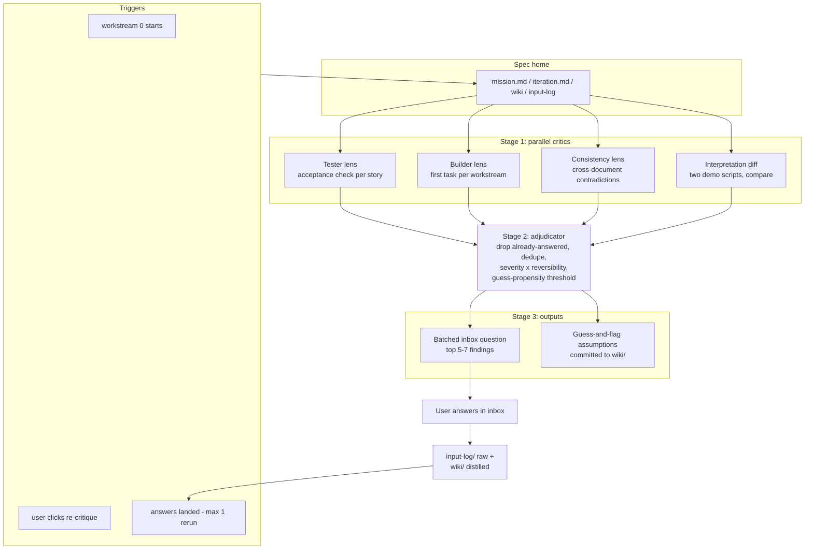

# Spec critique

An LLM process that surfaces underspecified or contradictory specs *before* building starts. Companion to the per-task ambiguity protocol (`architecture.md` §3), which remains the safety net for whatever critique misses. Target is catching ~80% of spec problems cheaply, not absolute clarity.

**Principle: clarity = buildability.** A spec is never globally "clear"; it is clear enough when the next tasks can be written with verifiable acceptance criteria without expensive guessing. Critics therefore never opine on prose quality — every finding must be anchored to a concrete artifact the critic failed to produce (a test it couldn't write, a task it couldn't spec, two interpretations that diverged).

## Shape: parallel critics + one adjudicator (not free-form debate)

Evidence says iterative LLM self-critique plateaus after 2–3 rounds, same-model critique suffers self-bias, and independent parallel critiques aggregate better than long debates at matched compute. So: one round of independent critics, one adjudication pass, bounded reruns.

### Stage 1 — parallel critics (one LLM call each, different lenses; cross-model when available)

- **Tester lens** (unverifiability): for each user story in `iteration.md`, write the acceptance check you'd run; flag every story where you can't.
- **Builder lens** (underspecification): draft the first task for each plausible workstream; flag every decision you'd have to guess that is expensive to reverse.
- **Consistency lens** (coherence): find contradictions between `mission.md`, `iteration.md`, `wiki/`, and prior answers in `input-log/`.
- **Interpretation diff** (highest-precision signal, optional): two models each write a one-page "demo script of the finished iteration"; divergences are ambiguities that matter, by construction.

### Stage 2 — adjudicator

Takes all findings and, for each: drops it if the spec or `input-log/` already answers it (critic misread), dedupes, scores severity × reversibility, and drops everything below the project's guess-propensity threshold. This filter is essential: an unfiltered critic is a bloat generator, and pedantic inbox questions erode trust in the clarification loop faster than missed ambiguities do.

### Stage 3 — output through existing machinery

- Surviving findings become **one batched inbox question** (top ~5–7, ranked).
- Below-the-ask-bar items become **guess-and-flag assumptions** committed to `wiki/`.
- Raw answers land in `input-log/`, distilled into `wiki/` — same memory path as all clarifications.

## Diagram

## Triggers and budget

1. **Workstream 0 start** (always): critique runs before the user interview; its findings *are* the interview's first batch of questions.
2. **After answers land**: at most one rerun. Converged when the adjudicator accepts zero new findings — or after 2 total rounds, whichever is first.
3. **On demand**: a "re-run spec critique" action on the project page. Useful after the user edits the spec repo directly or pivots the iteration goal mid-flight.

## Staleness tracking

The project records `last_critique_sha` (spec-home HEAD at critique time) and `last_critique_at`. Since the digest is re-read every orchestrator invocation, staleness is cheap to compute: `git diff --stat last_critique_sha..HEAD` in the spec clone, plus the count of input-log entries added since. The project page shows "spec critique: N commits / M files changed since last run" next to the re-run action, so the user can judge whether a rerun is worth the tokens. The orchestrator may also cite this drift when it proactively suggests a rerun (e.g. after a large direct spec edit), but it never reruns on its own outside triggers 1–2 — on-demand means the human spends that budget.

## Sources (condensed)

- Multi-agent debate for ambiguity detection: leader-follower with 2 followers, role rotation, capped rounds — [arXiv 2507.12370](https://arxiv.org/html/2507.12370); MAD-for-RE survey [arXiv 2507.05981](https://arxiv.org/pdf/2507.05981) (better recall, higher cost, adaptive stopping).
- Iterative self-critique: plateaus after 2–3 rounds ([Self-Refine](https://selfrefine.info/)); self-bias requires cross-model critics; parallel independent critiques beat iterative refinement at matched compute ([arXiv 2604.22273](https://arxiv.org/html/2604.22273v2)).
- Rubrics from classic RE: requirements-smells taxonomy — ambiguity and unverifiability rated most severe ([arXiv 2404.11106](https://arxiv.org/html/2404.11106v1)); perspective-based reading; back-translation / interpretation diffing ([ClarifySTL](https://arxiv.org/html/2605.01209)).
